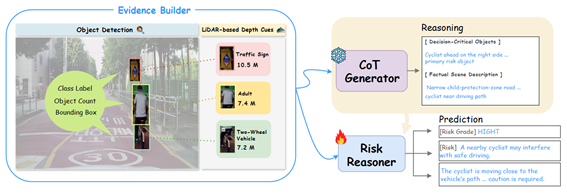
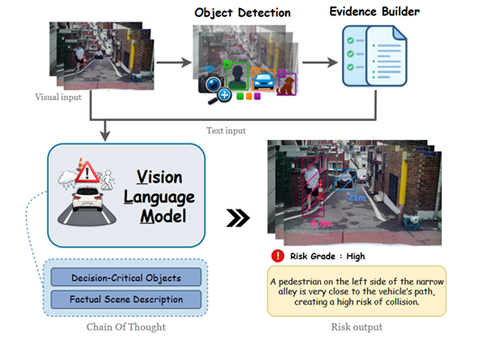
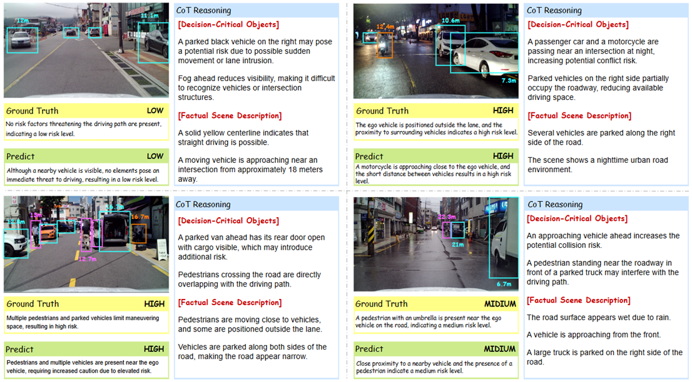

# EGRR :  Evidence-Guided Risk Reasoning for Explainable Autonomous Driving 

> 자율주행 위험 판단을 위한 증거 기반 설명형 추론 프레임워크입니다.

```text
본 프로젝트는 도로 주행 장면 이미지와 객체 탐지 기반 증거를 함께 활용하여, 자율주행 상황의 위험도를 판단하고 그 근거를 설명하는 Vision-Language 기반 위험 추론 시스템입니다.
기존의 위험도 분류 방식은 최종 위험 등급만 예측하는 경우가 많아, 어떤 객체와 장면 요소가 판단에 영향을 주었는지 설명하기 어렵습니다.
본 프로젝트에서는 YOLO 기반 객체 탐지 결과와 거리 정보를 구조화된 evidence로 변환하고, 이를 VLM 입력에 함께 제공하여 모델이 이미지뿐 아니라 명시적인 객체 수준 근거를 참고하도록 설계했습니다.
```

---

## Paper

**EGRR: Evidence-Guided Risk Reasoning for Explainable Autonomous Driving**

* Korean Title: 자율주행 위험 판단을 위한 증거 기반 설명형 추론 프레임워크
* Target Task: Autonomous Driving Risk Reasoning
* Keywords: autonomous driving, risk reasoning, explainable AI, object-level evidence, chain-of-thought

---

## Datasets

The datasets used or referred to in this project are listed below.

| Name | Source | Description |
|------|--------|-------------|
| [AI Hub 생활도로 객체인식 자율주행 데이터](https://www.aihub.or.kr/aihubdata/data/view.do?srchOptnCnd=OPTNCND001&currMenu=115&topMenu=100&searchKeyword=%EC%A3%BC%ED%96%89&aihubDataSe=data&dataSetSn=71784) | AI Hub | 생활도로 주행 장면 이미지, 객체 라벨, LiDAR 기반 좌표 및 거리 정보 |
| [EGRR Risk Data](https://drive.google.com/drive/folders/1CafB0KGNFN569KQLjK8ZdqqbBGk2ezo-?usp=drive_link) | 자체 구축 / 자체 생성 | 이미지별 위험도 등급, 위험 설명 라벨, YOLO 기반 구조화 객체 증거 |

> Raw image data is not redistributed in this repository.  
> Please download the original driving scene data from AI Hub and use the provided EGRR Risk Data for risk reasoning experiments.

---

## Key Features

### Evidence Builder

The Evidence Builder converts object detection results into structured textual evidence.  
It summarizes object categories, bounding box positions, object counts, and ego-vehicle-relative distance information.

<p align="center">
  
</p>

<p align="center">
  <em>Figure 1. Evidence Builder and CoT-based risk reasoning process.</em>
</p>

The generated evidence helps the VLM focus on decision-critical objects such as pedestrians, vehicles, traffic signs, and two-wheel vehicles.  
By combining visual input with structured evidence, the model can produce more grounded and explainable risk reasoning.

---

### Object-aware Risk Reasoning

The system receives both:

1. Road scene image
2. Structured object evidence JSON

Then it generates:

1. Decision-critical objects
2. Factual scene description
3. Risk grade
4. Risk explanation

---

### CoT-style Structured Output

The model is trained to produce a fixed reasoning format.

```text
[Decision-Critical Objects]
- Objects that directly affect driving safety and why they matter.

[Factual Scene Description]
- Fact-grounded description of the observed road scene.

[Risk Grade]
L / M / H

[Risk]
A one-line summary of the key reason for the predicted risk level.
```

This structure helps the model connect observed evidence to the final risk decision.

---

## System Pipeline

<p align="center">
  
</p>

<p align="center">
  <em>Figure 2. Overall architecture of the proposed EGRR framework.</em>
</p>

The proposed framework first detects road objects from the input driving scene image and converts the detection results into structured object-level evidence.  
The image and evidence are then jointly provided to the Vision-Language Model, which performs CoT-style reasoning and predicts the final risk level with a natural-language explanation.

---

## Output Example

```text
[Decision-Critical Objects]
- 전방의 차량은 자차 주행 경로와 가까워 감속 또는 거리 유지가 필요할 수 있다.
- 측면의 보행자는 도로 가장자리와 인접해 있어 갑작스러운 진입 가능성에 주의가 필요하다.

[Factual Scene Description]
- 도로 전방에 차량이 존재한다.
- 주변에 보행자 또는 도로 이용자가 관측된다.
- 일부 객체는 자차 진행 방향과 가까운 위치에 있다.

[Risk Grade]
M

[Risk]
전방 차량과 주변 보행자 가능성으로 인해 주행 중 감속 및 주의가 필요한 상황이다.
```

---

## Reasoning Example

<p align="center">
  
</p>

<p align="center">
  <em>Figure 3. Examples of CoT-based risk reasoning outputs.</em>
</p>

The examples show how EGRR connects object-level evidence with the final risk decision.  
For each road scene, the model identifies decision-critical objects, describes the factual scene context, and generates a concise risk explanation.

---

## My Contributions

* Research Framework Design
* Evidence Builder Design
* Risk Labeling & Dataset Construction
* CoT-style Reasoning Format Design
* Ablation Experiments
* Evaluation & Analysis
  
---

## Limitations & Future Work

* Since the current framework performs risk assessment based on a single image frame, it should be extended to temporal reasoning using consecutive frames.
* Errors in object detection results may propagate through the Evidence Builder and affect the final risk judgment.
* Additional evaluation is needed under diverse real-world driving conditions, such as rain, night scenes, backlight, and complex intersections.
* Future work should integrate multimodal sensor information such as video input, LiDAR point clouds, and HD maps.
* The framework can be extended beyond risk-level prediction to driving action suggestions, such as slowing down, stopping, or avoiding lane changes.

---
